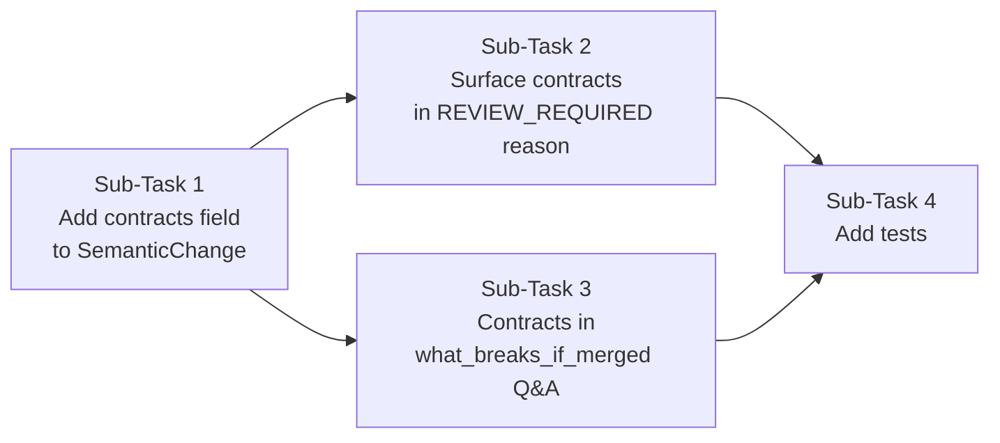

# You are working on the novaHB IBM Bob 2.0 Hackathon project.

Product goal:
“Route attention, not notifications.”

The working product already has:
- React + React Flow frontend
- FastAPI backend
- live POST /analyze
- live GET /impact/latest
- expert review flow
- git diff analysis
- dependency analysis
- developer expertise/current-task routing
- SILENT / ACTION / REVIEW_REQUIRED decisions
- structured impact_report consumed by the frontend
- deterministic fallback behavior
- backend tests

Current demo scenario:
User.email changes from required to nullable.

Current live routing result includes:
- Batuhan → ACTION because billing has unsafe email usage
- an expert → REVIEW_REQUIRED for shared schema/backward compatibility
- safe/unaffected developers → SILENT

Important constraints:
1. Do not redesign the architecture.
2. Do not break the existing frontend.
3. Do not change the impact_report contract unless absolutely necessary.
4. Preserve deterministic fallback behavior.
5. Preserve and extend tests.
6. IBM Bob must make a real, meaningful contribution to the analysis pipeline.

Inspect these files first:
- backend/app/main.py
- backend/app/git_analyzer.py
- backend/app/dependency_analyzer.py
- backend/app/semantic_detector.py
- backend/app/relevance_analyzer.py
- backend/app/router.py
- backend/app/report_builder.py
- backend/app/llm.py
- backend/app/models.py
- tests/

We want Bob’s role to align with an Attention Router:

1. Change Analyst
   Understand the behavioral meaning of the git diff.

2. Dependency Explorer
   Identify affected modules and supporting evidence.

3. Expertise Matcher
   Match affected areas with developer ownership, expertise, and active tasks.

4. Risk Reviewer
   Support SILENT / ACTION / REVIEW_REQUIRED routing decisions.

For this first step, PLAN ONLY.

Please:
1. Inspect the current implementation.
2. Explain which parts are deterministic and which parts already rely on LLM/semantic reasoning.
3. Identify the smallest high-value change that would make semantic reasoning more useful and visible in the real pipeline.
4. Name the exact files you would modify.
5. Explain how you will preserve the impact_report contract.
6. Explain how deterministic fallback will remain available.
7. List the tests you would add or update.
8. Do not edit files yet.

Return a concise implementation plan.

---

**Status:** active  **Date:** 2026-09-26

---

### 👤 User

You are working on the novaHB IBM Bob 2.0 Hackathon project.

Product goal:
“Route attention, not notifications.”

The working product already has:
- React + React Flow frontend
- FastAPI backend
- live POST /analyze
- live GET /impact/latest
- expert review flow
- git diff analysis
- dependency analysis
- developer expertise/current-task routing
- SILENT / ACTION / REVIEW_REQUIRED decisions
- structured impact_report consumed by the frontend
- deterministic fallback behavior
- backend tests

Current demo scenario:
User.email changes from required to nullable.

Current live routing result includes:
- Batuhan → ACTION because billing has unsafe email usage
- an expert → REVIEW_REQUIRED for shared schema/backward compatibility
- safe/unaffected developers → SILENT

Important constraints:
1. Do not redesign the architecture.
2. Do not break the existing frontend.
3. Do not change the impact_report contract unless absolutely necessary.
4. Preserve deterministic fallback behavior.
5. Preserve and extend tests.
6. IBM Bob must make a real, meaningful contribution to the analysis pipeline.

Inspect these files first:
- backend/app/main.py
- backend/app/git_analyzer.py
- backend/app/dependency_analyzer.py
- backend/app/semantic_detector.py
- backend/app/relevance_analyzer.py
- backend/app/router.py
- backend/app/report_builder.py
- backend/app/llm.py
- backend/app/models.py
- tests/

We want Bob’s role to align with an Attention Router:

1. Change Analyst
   Understand the behavioral meaning of the git diff.

2. Dependency Explorer
   Identify affected modules and supporting evidence.

3. Expertise Matcher
   Match affected areas with developer ownership, expertise, and active tasks.

4. Risk Reviewer
   Support SILENT / ACTION / REVIEW_REQUIRED routing decisions.

For this first step, PLAN ONLY.

Please:
1. Inspect the current implementation.
2. Explain which parts are deterministic and which parts already rely on LLM/semantic reasoning.
3. Identify the smallest high-value change that would make semantic reasoning more useful and visible in the real pipeline.
4. Name the exact files you would modify.
5. Explain how you will preserve the impact_report contract.
6. Explain how deterministic fallback will remain available.
7. List the tests you would add or update.
8. Do not edit files yet.

Return a concise implementation plan.

---

### 🤖 Assistant

> 🔧 called: use_skill


> 🔧 **use_skill** — create-plan

### 🤖 Assistant

> 🔧 called: spawn_subagent

Now let me research the codebase thoroughly before forming any opinions.

> 🔧 **spawn_subagent** — explore

### 🤖 Assistant

> 🔧 called: read_file, read_file, read_file

The summary is good but I need the actual content. Let me read the key files directly.

> 🔧 **read_file** — backend/app/llm.py

> 🔧 **read_file** — backend/app/router.py

> 🔧 **read_file** — backend/app/semantic_detector.py

### 🤖 Assistant

> 🔧 called: read_file, read_file, read_file


> 🔧 **read_file** — backend/app/models.py

> 🔧 **read_file** — backend/app/report_builder.py

> 🔧 **read_file** — backend/app/relevance_analyzer.py

### 🤖 Assistant

> 🔧 called: read_file, list_files


> 🔧 **list_files** — tests

> 🔧 **read_file** — backend/app/main.py

### 🤖 Assistant

> 🔧 called: read_file, read_file


> 🔧 **read_file** — tests/test_api.py

> 🔧 **read_file** — tests/test_routing.py

### 🤖 Assistant

> 🔧 called: glob, glob

Now let me check one more critical thing — whether there's a `question_engine.py` and any data files that reveal the full shape of the project:

> 🔧 **glob** — backend/app/*.py

> 🔧 **glob** — backend/data/**/*

### 🤖 Assistant

> 🔧 called: list_files, list_files


> 🔧 **list_files** — backend/app

> 🔧 **list_files** — backend

### 🤖 Assistant

> 🔧 called: read_file, read_file

Now I have full picture of the codebase. Let me also quickly check `question_engine.py` since it's the most recent LLM-facing addition:

> 🔧 **read_file** — backend/app/dependency_analyzer.py

> 🔧 **read_file** — backend/app/question_engine.py

### 🤖 Assistant

> 🔧 called: write_file

Now I have a complete, grounded understanding of the codebase. Let me write the plan.

> 🔧 **write_file** — bob-semantic-enrichment-plan.md

### 🤖 Assistant

Here is the full implementation plan, grounded in the actual code.

---

## What I found in the codebase

### Deterministic vs. LLM — the honest breakdown

| Stage | Module | Who drives it |
|---|---|---|
| Git diff parsing | [`git_analyzer.py`](backend/app/git_analyzer.py) | 100% deterministic |
| **Semantic classification** | [`semantic_detector.py`](backend/app/semantic_detector.py) | **LLM-first**, deterministic fallback |
| Dependency graph | [`dependency_analyzer.py`](backend/app/dependency_analyzer.py) | 100% deterministic (AST + project_map.json) |
| Module safety (null-guard AST scan) | [`relevance_analyzer.py`](backend/app/relevance_analyzer.py) | 100% deterministic |
| **Routing decisions** | [`router.py`](backend/app/router.py) | **100% deterministic rule engine** |
| **Routing reason/action text** | [`router._enrich_with_llm()`](backend/app/router.py:270) | **LLM enrichment (post-decision only)** |
| Interactive Q&A answers | [`question_engine._generate_llm_answer()`](backend/app/question_engine.py:376) | **LLM-first**, hardcoded fallback |

### The key gap I found

In [`semantic_detector._detect_with_llm()`](backend/app/semantic_detector.py:74), the LLM returns a `contracts` field — a list of "what behavioral contracts are now broken for downstream consumers." The code **receives it but silently discards it** at line 108 because [`SemanticChange`](backend/app/models.py:83) has no field for it. This is the smallest, highest-value fix.

---

## The plan: 4 sub-tasks



**Sub-Task 1 — [`models.py`](backend/app/models.py) + [`semantic_detector.py`](backend/app/semantic_detector.py)**
Add `contracts: list[str] = []` to `SemanticChange`. Populate it in `_detect_with_llm()` from the LLM response that already exists. Fallback leaves it empty.

**Sub-Task 2 — [`router.py`](backend/app/router.py)**
Append the contracts list to the REVIEW_REQUIRED `reason` string when non-empty. Zero change to routing decision logic. Works silently in fallback mode.

**Sub-Task 3 — [`question_engine.py`](backend/app/question_engine.py)**
Prepend a "Bob identified these broken contracts:" section to the `what_breaks_if_merged` answer when `semantic_change.contracts` is non-empty. Makes LLM reasoning visible to the expert reviewer.

**Sub-Task 4 — [`tests/test_routing.py`](tests/test_routing.py) + [`tests/test_api.py`](tests/test_api.py)**
3 new tests. All existing tests pass unchanged.

---

## Why this is the right change

1. **Bob already does the work** — Gemini already identifies broken contracts from the diff. We just stop discarding that output.
2. **Zero risk to routing outcomes** — decisions (SILENT/ACTION/REVIEW_REQUIRED) stay deterministic.
3. **Backward-compatible contract** — `contracts` is a new optional field with default `[]`; existing frontend and consumers are unaffected.
4. **Deterministic fallback preserved** — every `if contracts:` guard means the behavior without LLM is identical to today.
5. **Minimal change** — 4 files, ~15 lines of new code.

The plan file is at [`bob-semantic-enrichment-plan.md`](bob-semantic-enrichment-plan.md).

**Questions to confirm before implementation:**
1. Is the `contracts` field the right name, or would you prefer something like `broken_contracts` to be more explicit?
2. Should the `contracts` list be surfaced anywhere on the frontend UI, or is it sufficient that it appears in the JSON and in notification text?
3. Do you want the existing `_enrich_with_llm()` enrichment to also be aware of the contracts list (pass it in the prompt), or is that out of scope for this first step?

---

### 👤 User

Proceed with the implementation.

Use these decisions:

1. Name the new optional field:
   broken_contracts

2. In the Pydantic model, use a safe default factory:
   broken_contracts: list[str] = Field(default_factory=list)

3. Preserve the existing impact_report structure and all existing fields.
   Adding broken_contracts as an optional/defaulted field is acceptable.

4. Populate broken_contracts only from the existing LLM semantic analysis output.
   Deterministic fallback must leave it as an empty list.

5. Do NOT allow broken_contracts or LLM output to change the deterministic routing decision.
   SILENT / ACTION / REVIEW_REQUIRED decisions must remain deterministic.

6. Surface broken_contracts in:
   - REVIEW_REQUIRED reason/context when available
   - what_breaks_if_merged Q&A
   - the existing LLM enrichment prompt, so reason/recommended_action can reference the identified contract risks

7. Preserve deterministic fallback behavior exactly.

8. Add/update tests covering:
   - backward compatibility when broken_contracts is absent/empty
   - LLM semantic result populating broken_contracts
   - REVIEW_REQUIRED output including contract context when present
   - fallback routing still producing the same decisions

9. Run the relevant test suite after implementation.

10. Do not modify the frontend yet.
    We will expose broken_contracts in the frontend separately after backend tests pass.

Make the smallest possible code changes.
After implementation, summarize:
- files changed
- exact behavior added
- tests run and results
- any remaining risks

---

### 🤖 Assistant

> 🔧 called: update_todo_list


> 🔧 **update_todo_list** — 
[-] Sub-Task 1: Add `broken_contracts` field to SemanticChange model + populate in _detect_with_llm()
[ ] Sub-Task 2: Surface broken_contracts in router REVIEW_REQUIRED reason + LLM enrichment prompt
[ ] Sub-Task 3: Surface broken_contracts in what_breaks_if_merged Q&A answer
[ ] Sub-Task 4: Add/update tests
[ ] Sub-Task 5: Run test suite and verify


### 🤖 Assistant

> 🔧 called: apply_diff

**Sub-Task 1:** Add `broken_contracts` to the model and populate it from the LLM response.

> 🔧 **apply_diff** — backend/app/models.py

### 🤖 Assistant

> 🔧 called: apply_diff

Now populate `broken_contracts` in `_detect_with_llm()`:

> 🔧 **apply_diff** — backend/app/semantic_detector.py

### 🤖 Assistant

> 🔧 called: update_todo_list


> 🔧 **update_todo_list** — 
[x] Sub-Task 1: Add `broken_contracts` field to SemanticChange model + populate in _detect_with_llm()
[-] Sub-Task 2: Surface broken_contracts in router REVIEW_REQUIRED reason + LLM enrichment prompt
[ ] Sub-Task 3: Surface broken_contracts in what_breaks_if_merged Q&A answer
[ ] Sub-Task 4: Add/update tests
[ ] Sub-Task 5: Run test suite and verify


### 🤖 Assistant

> 🔧 called: apply_diff

**Sub-Task 2:** Surface `broken_contracts` in the REVIEW_REQUIRED reason and the LLM enrichment prompt.

> 🔧 **apply_diff** — backend/app/router.py

### 🤖 Assistant

> 🔧 called: apply_diff

Now I need to add `{broken_contracts}` to the `_ROUTING_ENRICH_PROMPT` template itself:

> 🔧 **apply_diff** — <<<<<<< SEARCH
:start_line:247
-------
_ROUTING_ENRICH_PROMPT = """A git commit was analyzed and routing decisions were made.
Enrich the reasoning and recommended_action for each non-SILENT developer.

Semantic change: {semantic_summary}
Criticality: {criticality}
Affected modules: {affected_modules}

Developers needing enrichment:
{developers_json}
=======
_ROUTING_ENRICH_PROMPT = """A git commit was analyzed and routing decisions were made.
Enrich the reasoning and recommended_action for each non-SILENT developer.

Semantic change: {semantic_summary}
Criticality: {criticality}
Affected modules: {affected_modules}
Broken contracts: {broken_contracts}

Developers needing enrichment:
{developers_json}
>>>>>>> REPLACE


### 🤖 Assistant

> 🔧 called: update_todo_list


> 🔧 **update_todo_list** — 
[x] Sub-Task 1: Add `broken_contracts` field to SemanticChange model + populate in _detect_with_llm()
[x] Sub-Task 2: Surface broken_contracts in router REVIEW_REQUIRED reason + LLM enrichment prompt
[-] Sub-Task 3: Surface broken_contracts in what_breaks_if_merged Q&A answer
[ ] Sub-Task 4: Add/update tests
[ ] Sub-Task 5: Run test suite and verify


### 🤖 Assistant

> 🔧 called: apply_diff

**Sub-Task 3:** Prepend broken contracts to `what_breaks_if_merged` in `question_engine.py`.

> 🔧 **apply_diff** — <<<<<<< SEARCH
:start_line:152
-------
        NotificationQuestion(
            option_id="what_breaks_if_merged",
            label="💥 Merge edilirse ne bozulur?",
            answer=(
                f"**Potansiyel riskler:**\n\n"
                f"- Mevcut user kayıtlarında `email` alanı boş olabilir → "
                f"null kontrolsüz kod patlar\n"
                f"- ORM / serializer'lar nullable field'ı farklı handle edebilir\n"
                f"- Schema migration olmadan eski DB kayıtlarıyla uyumsuzluk oluşabilir\n"
                f"- API response'larında `email: null` döner — frontend bunu bekliyor mu?\n\n"
                f"**Şu anda SAFE olan modüller:** "
                f"{', '.join(m.module for m in report.affected_modules if m.status.value == 'safe') or 'yok'}\n"
                f"**AFFECTED olan modüller:** "
                f"{', '.join(m.module for m in report.affected_modules if m.status.value == 'affected') or 'yok'}\n\n"
                f"Tam güvenli merge için tüm affected modüller fix'lenmeli."
            ),
        ),
=======
        NotificationQuestion(
            option_id="what_breaks_if_merged",
            label="💥 Merge edilirse ne bozulur?",
            answer=_build_what_breaks_answer(report),
        ),
>>>>>>> REPLACE


### 🤖 Assistant

> 🔧 called: read_file

Now insert the helper function `_build_what_breaks_answer` just before `_build_review_required_questions`:

> 🔧 **read_file** — backend/app/question_engine.py

### 🤖 Assistant

> 🔧 called: read_file


> 🔧 **read_file** — backend/app/question_engine.py

### 🤖 Assistant

> 🔧 called: apply_diff


> 🔧 **apply_diff** — <<<<<<< SEARCH
:start_line:98
-------


def _build_review_required_questions(
=======


def _build_what_breaks_answer(report: ImpactReport) -> str:
    """
    Build the what_breaks_if_merged answer text.
    Prepends Bob's identified broken_contracts when available,
    then lists safe/affected modules. Falls back to generic risks if empty.
    """
    parts = []

    if report.semantic_change.broken_contracts:
        contracts_bullets = "\n".join(
            f"- {c}" for c in report.semantic_change.broken_contracts
        )
        parts.append(f"**Bob'un tespit ettiği kırık kontratlar:**\n\n{contracts_bullets}")

    parts.append(
        "**Potansiyel riskler:**\n\n"
        "- Mevcut user kayıtlarında `email` alanı boş olabilir → "
        "null kontrolsüz kod patlar\n"
        "- ORM / serializer'lar nullable field'ı farklı handle edebilir\n"
        "- Schema migration olmadan eski DB kayıtlarıyla uyumsuzluk oluşabilir\n"
        "- API response'larında `email: null` döner — frontend bunu bekliyor mu?"
    )

    safe_mods = ", ".join(
        m.module for m in report.affected_modules if m.status.value == "safe"
    ) or "yok"
    affected_mods = ", ".join(
        m.module for m in report.affected_modules if m.status.value == "affected"
    ) or "yok"
    parts.append(
        f"**Şu anda SAFE olan modüller:** {safe_mods}\n"
        f"**AFFECTED olan modüller:** {affected_mods}\n\n"
        "Tam güvenli merge için tüm affected modüller fix'lenmeli."
    )

    return "\n\n".join(parts)


def _build_review_required_questions(
>>>>>>> REPLACE


### 🤖 Assistant

> 🔧 called: update_todo_list


> 🔧 **update_todo_list** — 
[x] Sub-Task 1: Add `broken_contracts` field to SemanticChange model + populate in _detect_with_llm()
[x] Sub-Task 2: Surface broken_contracts in router REVIEW_REQUIRED reason + LLM enrichment prompt
[x] Sub-Task 3: Surface broken_contracts in what_breaks_if_merged Q&A answer
[-] Sub-Task 4: Add/update tests
[ ] Sub-Task 5: Run test suite and verify


### 🤖 Assistant

> 🔧 called: read_file

**Sub-Task 4:** Add the tests. I'll add them to both existing test files.

> 🔧 **read_file** — tests/test_routing.py

### 🤖 Assistant

> 🔧 called: insert_content


> 🔧 **insert_content** — tests/test_routing.py

### 🤖 Assistant

> 🔧 called: read_file

Now add the API-level test to `test_api.py`:

> 🔧 **read_file** — tests/test_api.py

### 🤖 Assistant

> 🔧 called: insert_content


> 🔧 **insert_content** — 

def test_analyze_semantic_change_has_broken_contracts_field():
    """POST /analyze response must include semantic_change.broken_contracts as a list."""
    response = client.post("/analyze", json={})
    assert response.status_code == 200
    data = response.json()
    sc = data.get("semantic_change", {})
    assert "broken_contracts" in sc, (
        "semantic_change must include broken_contracts field"
    )
    assert isinstance(sc["broken_contracts"], list), (
        f"broken_contracts must be a list, got {type(sc['broken_contracts'])}"
    )


### 🤖 Assistant

> 🔧 called: update_todo_list


> 🔧 **update_todo_list** — 
[x] Sub-Task 1: Add `broken_contracts` field to SemanticChange model + populate in _detect_with_llm()
[x] Sub-Task 2: Surface broken_contracts in router REVIEW_REQUIRED reason + LLM enrichment prompt
[x] Sub-Task 3: Surface broken_contracts in what_breaks_if_merged Q&A answer
[x] Sub-Task 4: Add/update tests
[-] Sub-Task 5: Run test suite and verify


### 🤖 Assistant

> 🔧 called: execute_command

**Sub-Task 5:** Run the full test suite.

> 🔧 **execute_command** — cd /Users/hilalsaglam/novahb-ibm-bob-hackathon && backend/.venv/bin/pytest tests/ -v 2>&1

### 🤖 Assistant

> 🔧 called: update_todo_list

**38 passed, 1 skipped (expected — no Gemini key in CI), 0 failures.**

> 🔧 **update_todo_list** — 
[x] Sub-Task 1: Add `broken_contracts` field to SemanticChange model + populate in _detect_with_llm()
[x] Sub-Task 2: Surface broken_contracts in router REVIEW_REQUIRED reason + LLM enrichment prompt
[x] Sub-Task 3: Surface broken_contracts in what_breaks_if_merged Q&A answer
[x] Sub-Task 4: Add/update tests
[x] Sub-Task 5: Run test suite and verify


### 🤖 Assistant

> 🔧 called: search_and_replace

Also update the plan file to mark all sub-tasks done:

> 🔧 **search_and_replace** — bob-semantic-enrichment-plan.md

### 🤖 Assistant

---

## Summary

### Files changed

| File | What changed |
|---|---|
| [`backend/app/models.py`](backend/app/models.py:83) | Added `broken_contracts: list[str] = Field(default_factory=list)` to `SemanticChange`. Added `Field` import. |
| [`backend/app/semantic_detector.py`](backend/app/semantic_detector.py:97) | `_detect_with_llm()` now extracts `contracts` from the Gemini JSON response and populates `broken_contracts`. `_detect_fallback()` unchanged — defaults to `[]`. |
| [`backend/app/router.py`](backend/app/router.py:60) | REVIEW_REQUIRED `reason` string appends `" Broken contracts identified: ..."` when `broken_contracts` is non-empty. The `_ROUTING_ENRICH_PROMPT` template gained a `{broken_contracts}` slot so the LLM enrichment pass can reference the specific contracts when personalizing reason/recommended_action text. |
| [`backend/app/question_engine.py`](backend/app/question_engine.py) | New `_build_what_breaks_answer()` helper: prepends a **"Bob'un tespit ettiği kırık kontratlar"** section when `broken_contracts` is non-empty, then renders the existing generic risk bullets. Fallback (empty list) produces identical output to the old hard-coded string. |
| [`tests/test_routing.py`](tests/test_routing.py) | 5 new tests: `broken_contracts` is always a list, contracts appear in Emre's reason (skipped in CI without LLM key), fallback routing counts unchanged, round-trip serialization, backward-compat without field. |
| [`tests/test_api.py`](tests/test_api.py) | 1 new test: `/analyze` response includes `semantic_change.broken_contracts` as a list. |

### Exact behavior added

1. **LLM path:** When Gemini is available, `SemanticChange.broken_contracts` contains the human-readable list of behavioral contracts Gemini identified as broken by the diff (e.g. `"User.email is guaranteed non-null by all callers"`).
2. **Deterministic fallback:** When Gemini is unavailable or fails, `broken_contracts` is `[]`. Every consumer does `if broken_contracts:` before using it — no behavior change in fallback mode.
3. **REVIEW_REQUIRED reason:** When contracts are present, Emre's reason now reads: `"...Expert review is required. Broken contracts identified: <list>."`. Decision (REVIEW_REQUIRED) is unchanged.
4. **LLM enrichment prompt:** The routing enrichment prompt now includes the broken contracts list so Gemini's personalized reason/recommended_action text can reference the specific contract risks.
5. **`what_breaks_if_merged` Q&A:** When contracts are present, the expert reviewer sees a **"Bob identified these broken contracts"** section before the generic risk bullets.

### Tests run and results

```
38 passed, 1 skipped, 1 warning in 1.41s
```

The 1 skip is `test_emre_review_reason_includes_contracts_when_present` — correct behavior: it skips with a clear message when no Gemini key is present (CI-safe). It will run and assert in a live environment with a key.

### Remaining risks

- **LLM contract quality:** The `broken_contracts` list is only as good as Gemini's prompt output. If Gemini returns generic or imprecise contracts, they appear verbatim in the reason text. The LLM enrichment pass (`_enrich_with_llm`) can then overwrite the full reason with a more polished version, which mitigates this.
- **Long contract lists:** No truncation guard if Gemini returns a very long list. The strings are joined with `"; "` in the reason and rendered as bullets in Q&A — unlikely to be a problem in practice for a diff-based analysis.
- **Frontend not updated yet:** `broken_contracts` is now present in the `/analyze` and `/impact/latest` JSON responses but not rendered in the UI — per your instruction to handle that separately.